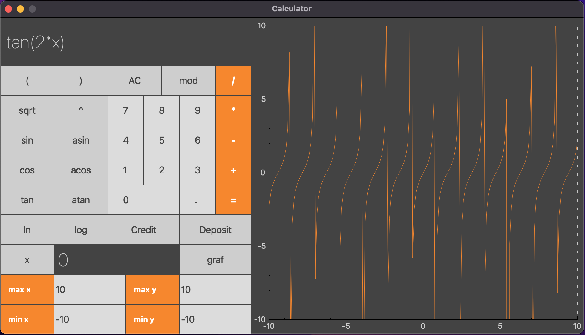
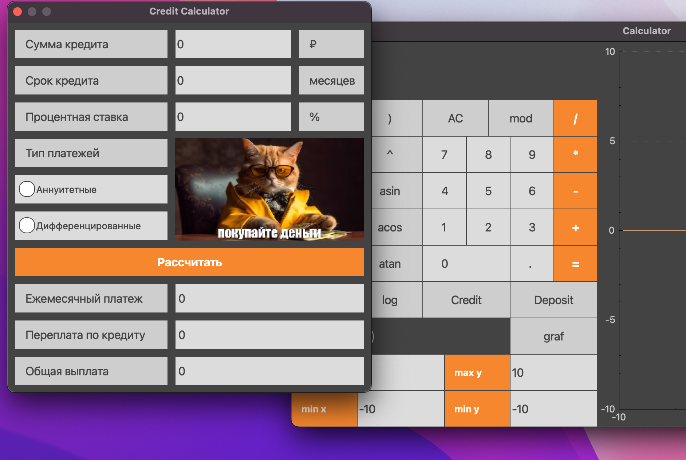

# calculator-c

В данном проекте, с использованием структурного подхода, реализована расширенная версия стандартного калькулятора. Помимо базовых арифметических операций, калькулятор дополнен возможностью арифметических выражений с учетом приоритетов, а так же некоторыми тригонометрическими функциями. Помимо вычисления выражений, калькулятор поддерживает использование переменной x и построение графика соответствующей функции. В добавок к этому всему, реализованы калькулятор вычисления кредита и калькулятор вкладов.

### Поддержка и использование

Приложение адаптировано для систем MacOS и Linux. Однако, для некоторых систем, потребуется установка дополнительных пакетов или библиотек. Для запуска, находясь в дирректории `src`, выполните:

```sh
make install && make open
```


Пример построения графика функции `tan(2*x)`:



Кредитный калькулятор:



Калькулятор вкладов:


Для запуска интеграционных тестов, выполните:

```sh
make test
```

Для вывода паспорта проекта и дополнительной информации, выполните:

```sh
make dvi
```