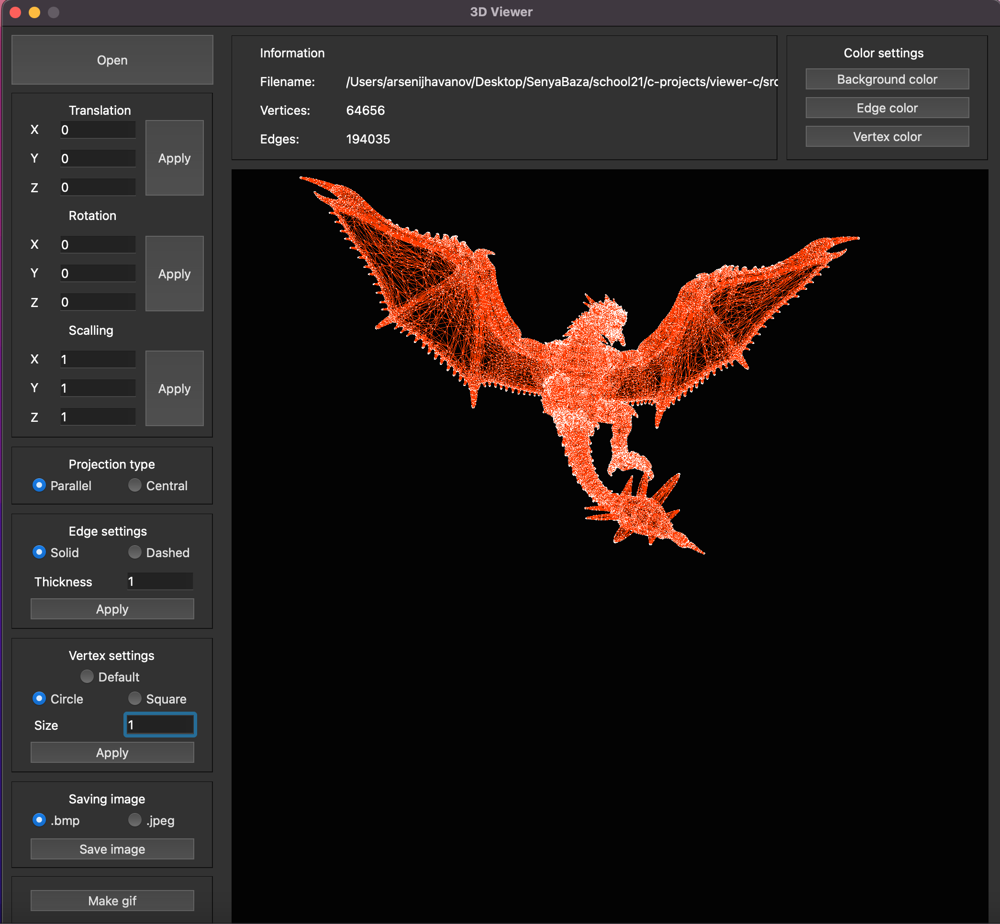

# viewer-c

В данном проекте реализована программа для просмотра 3D-моделей в каркасном виде. Сами модели загружаются из файлов формата `.obj`. Модели имеют свойсва вращения, масштабирования и перемещения. Подключена возможность настройки типа отображения проекций. Программа позволяет настраивать толщину, цвет и тип ребер, размер, цвет и способ отображения вершин. Так же, программа позволяет выбрать цвет фона и, присутстует сохранение настроек между сессиями программы (перезапусками).

- Программа разработана на языке Си стандарта C11 с использованием компилятора gcc
- Программа разработана в соответствии с принципами структурного программирования
- Графический интерфейс реализован на базе GUI-библиотеки Qt
- Графический интерфейс содержит:
    - Кнопку для выбора файла с моделью и поле для вывода его названия
    - Зону визуализации каркасной модели
    - Кнопки и поля ввода для перемещения модели
    - Кнопки и поля ввода для поворота модели
    - Кнопки и поля ввода для масштабирования модели
    - Информацию о загруженной модели - название файла, количество вершин и ребер
    - Подключена опция использования мыши для перемещения, поворота и масштабирования
- Код написан с использованием Google Style
- Подготовлено полное покрытие unit-тестами c помощью библиотеки Check

### Поддержка и использование

Приложение адаптировано для систем MacOS и Linux. Однако, для некоторых систем, потребуется установка дополнительных пакетов или библиотек. Для запуска, находясь в дирректории `src`, выполните:

```sh
make install && make open
```


Программа позволяет сохранять изображения в форматах `.jpeg` и `.bmp`, и записывать `gif-анимации`:


Для запуска интеграционных тестов, выполните:

```sh
make test
```

Для вывода паспорта проекта и дополнительной информации, выполните:

```sh
make dvi
```