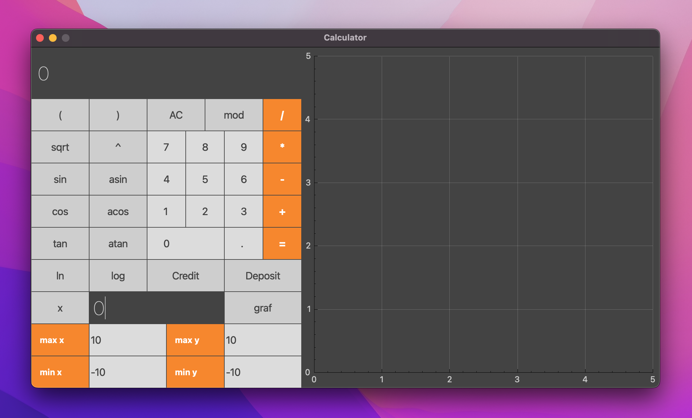
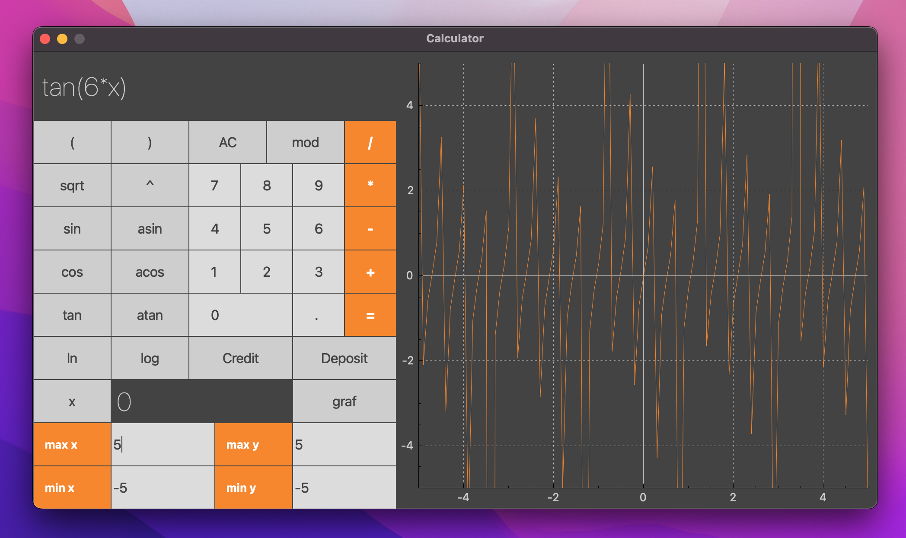
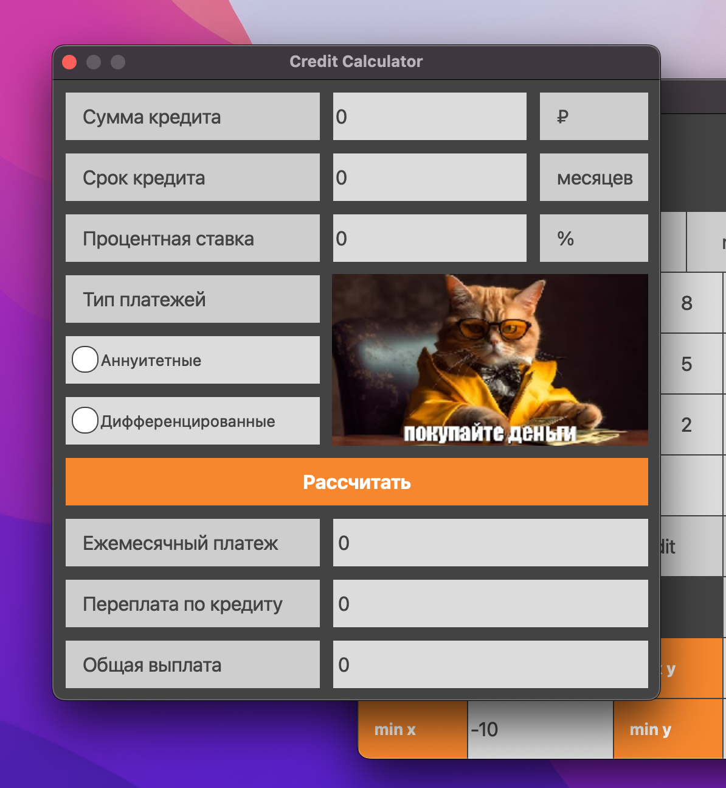
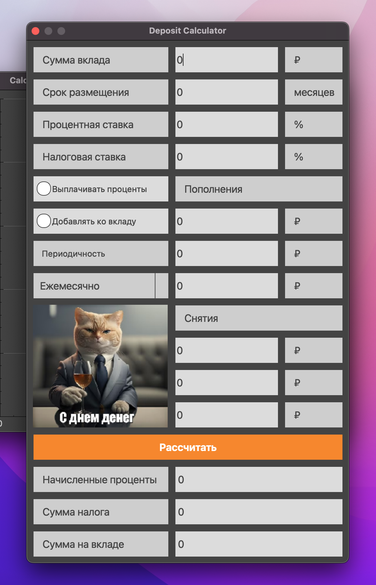

# calculator-cpp

В проекте реализован рефакторинг легаси кода [calculator-c](https://github.com/senyabanana/school21/tree/main/c-projects/calculator-c) в парадигме объектно-ориентированного программирования c использованием паттерна MVC (model-view-controller).

Помимо базовых арифметических операций, калькулятор дополнен возможностью арифметических выражений с учетом приоритетов, а так же некоторыми тригонометрическими функциями. Помимо вычисления выражений, калькулятор поддерживает использование переменной x и построение графика соответствующей функции. В добавок к этому всему, реализованы калькулятор вычисления кредита и калькулятор вкладов.

- Проект разработан на языке C++ стандарта C++17 с использованием компилятора gcc
- Код написан с использованием Google Style
- Подготовлено полное покрытие unit-тестами с использованием библиотеки GTest
- Был использован алгоритм "сортировочной станции" (Алгоритм Дейкстры) для разделения арифметического выражения на лексемы, основанный на стеке
- Графический интерфейс реализован на базе GUI-библиотеки Qt

### Арифметические операторы:

| Название оператора | Инфиксная нотация (Классическая) | Префиксная нотация (Польская нотация) |  Постфиксная нотация (Обратная польская нотация) |
| ------ | ------ | ------ | ------ |
| Скобки | (a + b) | (+ a b) | a b + |
| Сложение | a + b | + a b | a b + |
| Вычитание | a - b | - a b | a b - |
| Умножение | a * b | * a b | a b * |
| Деление | a / b | / a b | a b \ |
| Возведение в степень | a ^ b | ^ a b | a b ^ |
| Остаток от деления | a mod b | mod a b | a b mod |
| Унарный плюс | +a | +a | a+ |
| Унарный минус | -a | -a | a- |

### Функции:
  
| Описание функции | Функция |   
| ---------------- | ------- |  
| Вычисляет косинус | cos(x) |   
| Вычисляет синус | sin(x) |  
| Вычисляет тангенс | tan(x) |  
| Вычисляет арккосинус | acos(x) | 
| Вычисляет арксинус | asin(x) | 
| Вычисляет арктангенс | atan(x) |
| Вычисляет квадратный корень | sqrt(x) |
| Вычисляет натуральный логарифм | ln(x) | 
| Вычисляет десятичный логарифм | log(x) |

### Поддержка и использование

Приложение адаптировано для систем MacOS и Linux. Однако, для некоторых систем, потребуется установка дополнительных пакетов или библиотек. Для запуска, находясь в дирректории `src`, выполните:

```sh
make install && make open
```


Пример построения графика функции `tan(6*x)`:



Кредитный калькулятор:



Калькулятор вкладов:



Для запуска интеграционных тестов, выполните:

```sh
make test
```

Для вывода паспорта проекта и дополнительной информации, выполните:

```sh
make dvi
```