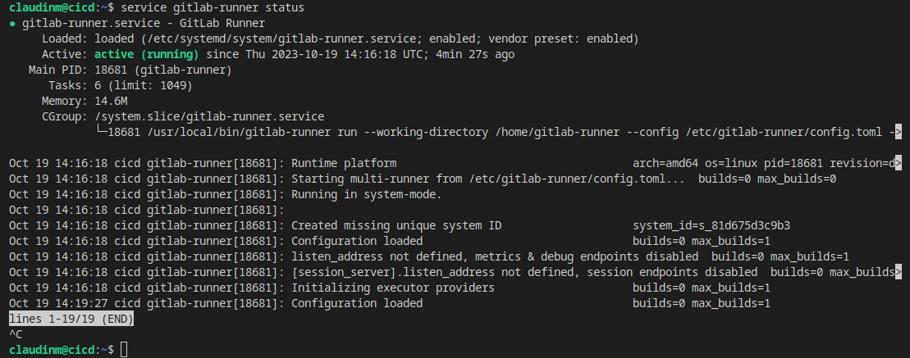
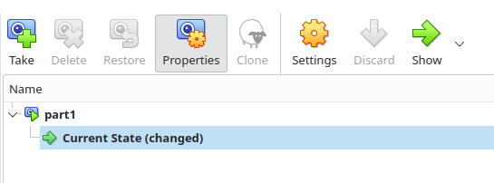
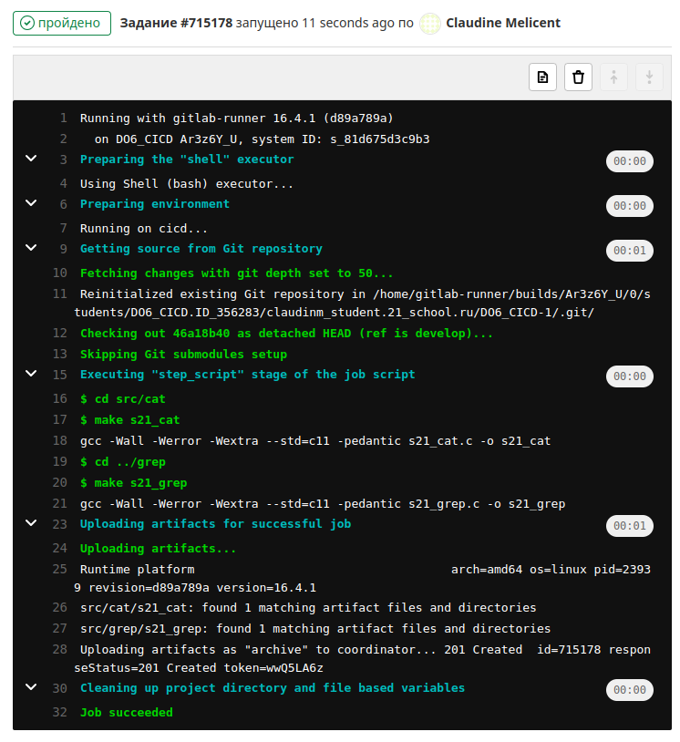
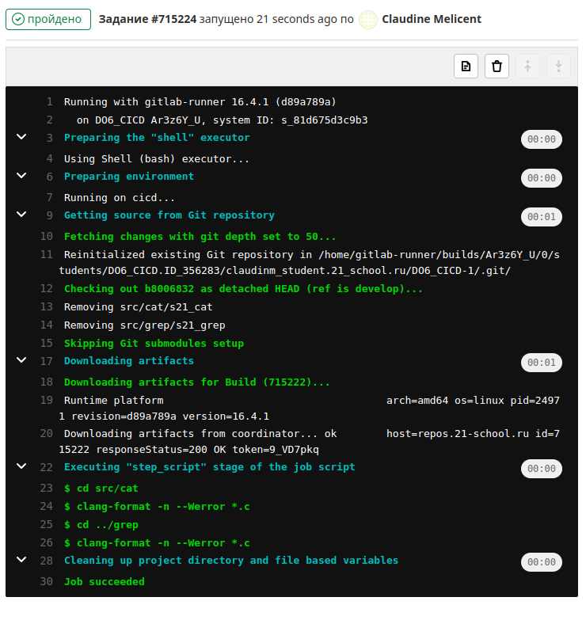
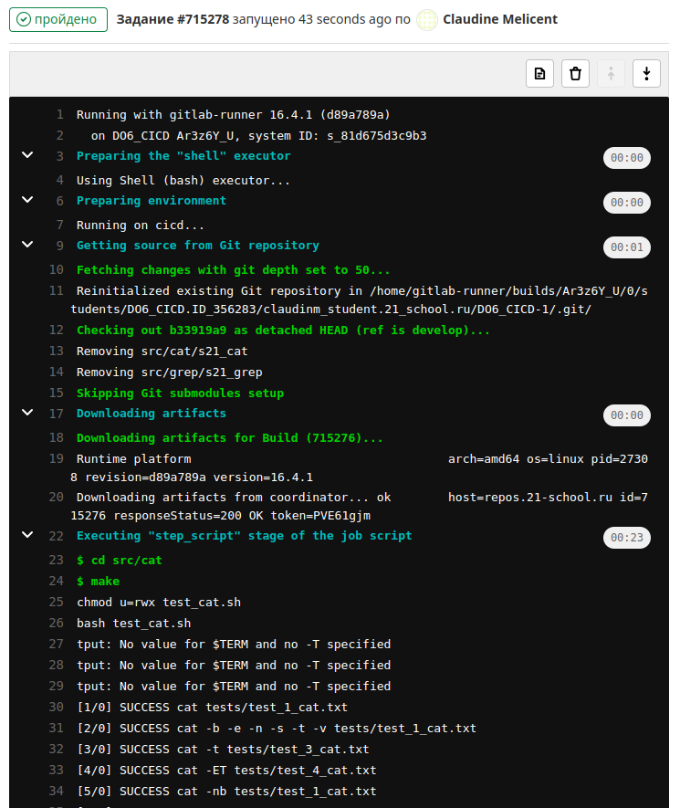
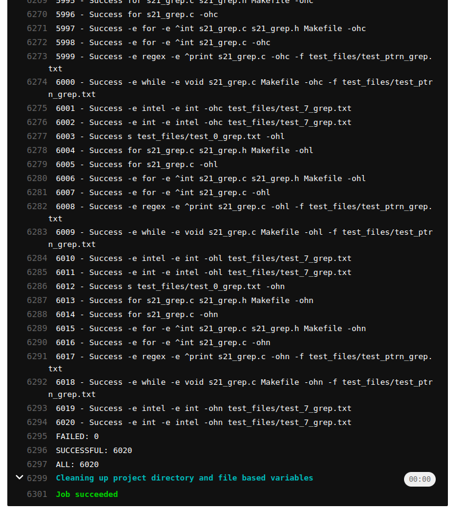
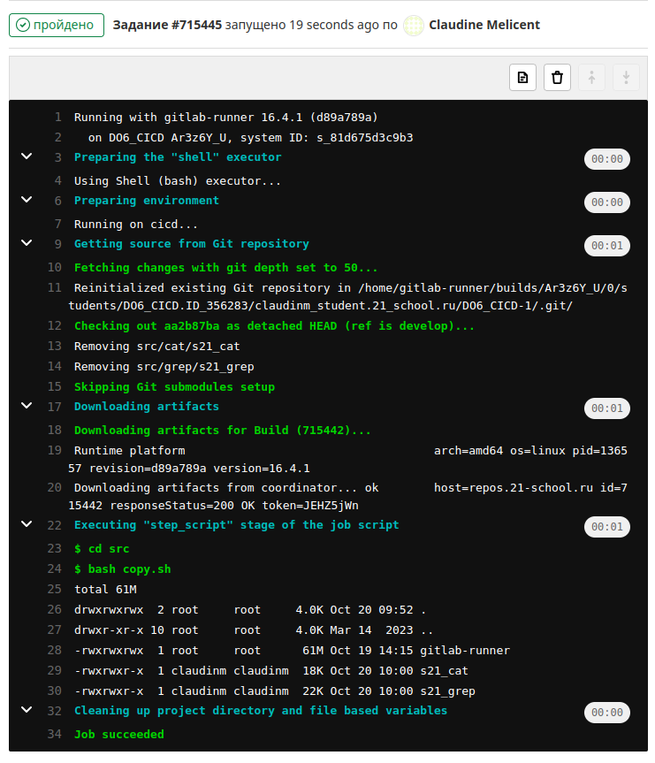
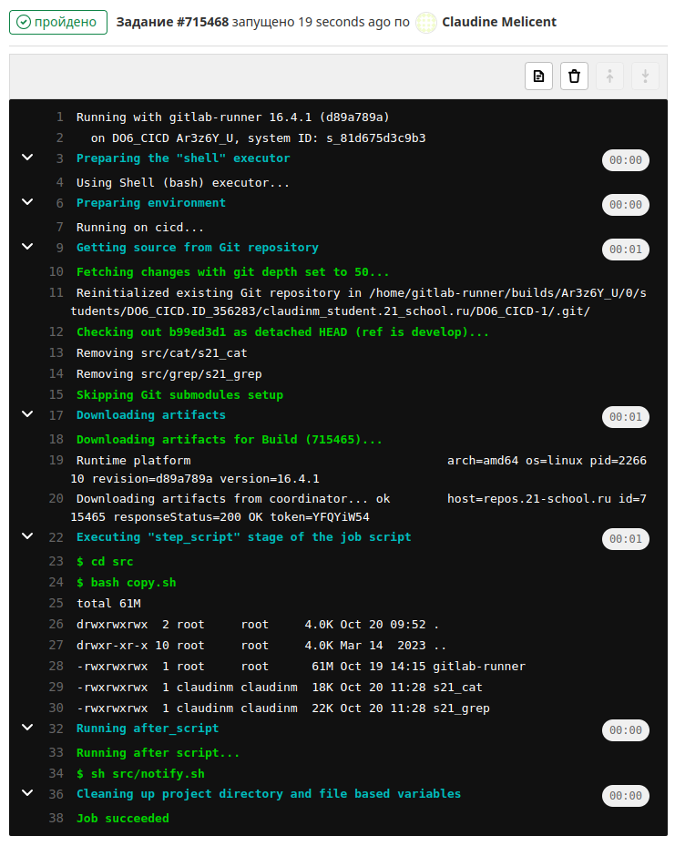
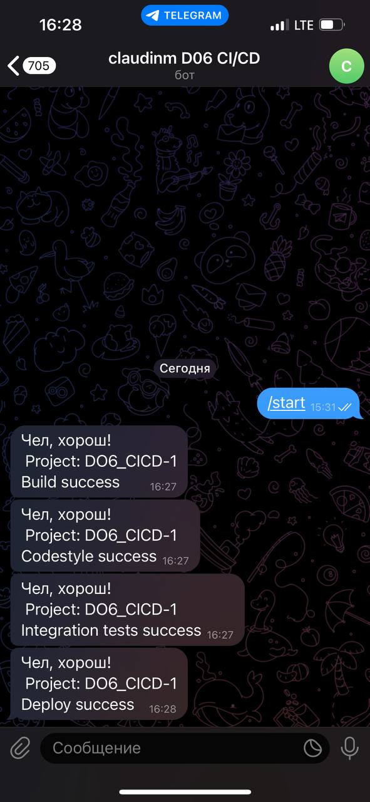

# Basic CI/CD

## Part 1. Настройка gitlab-runner

* Установка `gitlab-runner` 
    1. `sudo curl -L --output /usr/local/bin/gitlab-runner "https://gitlab-runner-downloads.s3.amazonaws.com/latest/binaries/gitlab-runner-linux-amd64"` 
    2. `sudo chmod +x /usr/local/bin/gitlab-runner` 
    3. `sudo useradd --comment 'GitLab Runner' --create-home gitlab-runner --shell /bin/bash` 
    4. `sudo gitlab-runner install --user=gitlab-runner --working-directory=/home/gitlab-runner` 
    5. `sudo gitlab-runner start` 
* Регистрация в `gitlab-runner` 
    1. `sudo gitlab-runner register` 
    2. URL: https://repos.21-school.ru 
    3. token: `<your_token_from_the_platform>` 
    4. `sudo gitlab-runner run` 
    5. `service gitlab-runner status` 
     *Проверяем статус* 
     *Делаем дамп образа* 

## Part 2. Сборка

  

## Part 3. Тест кодстайла

  

## Part 4. Интеграционные тесты

  
  

## Part 5. Этап деплоя

  

## Part 6. Дополнительно. Уведомления

  
  