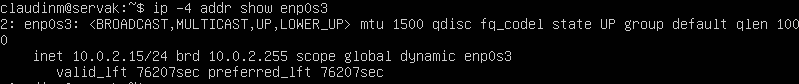
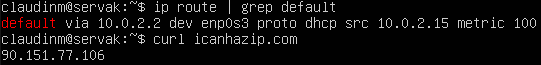
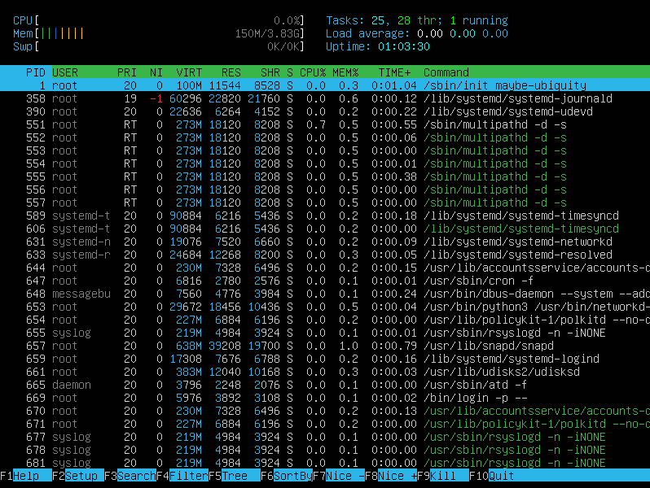
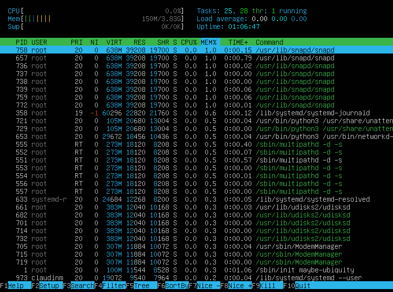
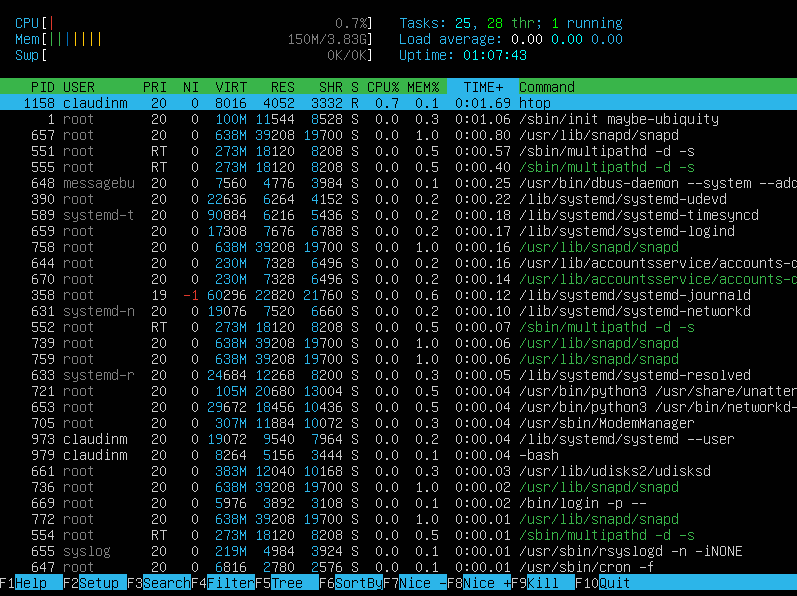

- ## ***Part 1. Установка ОС***

    1. ### **Версия Ubuntu:**

        

    ___
- ## ***Part 2. Создание пользователя***

    1. ### **Создание пользователя:**

        

    2. ### **Команда `/etc/passwd`:**

        

    3. ### **Пользователь в группе:**

        

    ___
- ## ***Part 3. Настройка сети ОС***

    1. ### **Задаем название хосту:**

        

    2. ### **Устанавливаем местоположение:**

        

    3. ### **Сетевые интерфейсы:**

        

            Сетевой интерфейс 'lo' (loopback) представляет собой специальный сетевой интерфейс, который используется для общения компьютера самого с собой. Это виртуальный интерфейс, который не связан с оборудованием и не зависит от его наличия. Использование loopback интерфейса позволяет запускать сетевые службы на одной и той же машине, на которой они используются, что полезно для разработки и тестирования ПО.

    4. ### **Получение ip-адреса от DHCP сервера:**

        

            DHCP (Dynamic Host Configuration Protocol) — это протокол, который позволяет компьютерам в сети автоматически получать настройки, необходимые для работы в сети, включая IP-адрес

    5. ### **Внутренний и внешний ip-адреса шлюзов:**

        

    6. ### **Задаем статичные настройки:**

        `sudo nano /etc/netplan/00-installer-config.yaml`

        

    7. ### **Для перезагрузки: `sudo reboot`**

        

        
    
    ___
- ## ***Part 4. Обновление ОС***

    1. ### **Обновление:**

        

    ___
- ## ***Part 5. Использование команды sudo***

    1. ### **Аббревиатура sudo:**

            Главное назначение sudo — это выполнить команду от имени другого пользователя, обычно от root. Смысл выполнения команды от root в том, что у него повышенные права доступа и, применяя sudo, обычный пользователь может выполнить те действия, на которые у него недостаточно прав.
        
        

    ___
- ## ***Part 6. Установка и настройка службы времени***

    1. ### **Синхронизация времени:**

        
    
    ___
- ## ***Part 7. Установка и использование текстовых редакторов***

    1. Для установки редактора VIM : `sudo apt install vim`

        - Режим редактирования: I

        - Выйти из режима редактирования: Esc

        - Для выхода и сохранения из редактора: :wq

        - Для выхода без сохранения: :q (для того чтобы обойти проверку: :q!)

        - Для поиска: /<текст>

        - Для замены: :s/<что заменяем>/<на что заменяем>

        

        

        

        

        

    2. Для установки редактора NANO : `sudo apt install nano`

        - Для выхода и сохранения из редактора: Ctrl+X, y

        - Для выхода без сохранения: Ctrl+X, n

        - Для поиска: Ctrl+W (Alt+W для перехода к следующему вхождению, Ctrl+C для прекращения поиска)

        - Для замены: Ctrl+\ (Enter + Y)

        

        

        

        

        

        

    3. Для установки редактора MCEDIT : `sudo apt install mcedit`

        - Для выхода и сохранения из редактора: F2 (yes), F10

        - Для выхода без сохранения: F2 (no)

        - Для поиска: F7 <текст> + <ок>

        - Для замены: F4 <что меняем> + <на что хоти поменять> + replace

        

        

        

        

___
- ## ***Part 8. Установка и базовая настройка сервиса SSHD***

    1. ### **Установка SSHd**

        - Установка SSH: `sudo apt-get install ssh`
        - Установка OpenSSH: `sudo apt install openssh-server`

    2. ### **Автозагрузка**

        - `sudo systemctl enable ssh`
        - `systemctl status ssh`

            

    3. ### **Перенастроить службу SSHd на порт 2022**

        - `sudo nano /etc/ssh/sshd_config`

            

        - Для того, чтобы изменения вступили в силу:

            

    4. ### **Команда ps и ключи к ней**

        - Команда `ps` выводит список текущих процессов на вашем сервере в виде таблицы, с которой можно удобно работать: сортировать, изменять количество колонок и прочие
        - `ps -A, -e (a)` - выбрать все процессы
        - `ps -a` - выбрать все процессы, кроме фоновых
        - `ps -d (g)` - выбрать все процессы, даже фоновые, кроме процессов сессий
        - `ps -N` - выбрать все процессы кроме указанных
        - `ps -C` - выбрать процессы по имени команды
        - `ps -G` - выбрать процессы по ID группы
        - `ps -p (p)` - выбрать процессы PID
        - `ps --ppid` - выбрать процессы по PID родительского процесса
        - `ps -s` - выбрать процессы по ID сессии
        - `ps -t (t)` - выбрать процессы по tty
        - `ps -u (U)` - выбрать процессы пользователя
        - `ps T` - просмотр процессов, связанных с этим терминалом
        - `ps r` - просмотр всех работающих процессов
        - `ps U <имя пользователя>` - найти все процессы, выполняемые конкретным пользователем

        ### **Наличие процесса SSHd**

        

    5. ### **Вывод отчета:**

        

        - -t (--tcp) отображает соедниеня только по tcp
        - -a (--all) вывод всех активных подключений TCP 
        - -n (--numeric) вывод активных подключений TCP с отображением адресов и номеров портов в числовом формате
        - Proto: Название протокола (протокол TCP или протокол UDP);
        - recv-Q: очередь получения сети
        - send-Q: Сетевая очередь отправки
        - Local Address адрес локального компьтера и используемы номер порта
        - Foreign Address адрес и номер удаленного компьтера к которомц подключен сокет
        - State состояние сокетв
        - 0.0.0.0 означает IP-адрес на локальной машине
___
- ## ***Part 9. Установка и использование утилит top, htop***

    1. ### **`top`**

        `top`

        

        - uptime - 40min
        - колличество авторизированных пользователей - 1
        - общую загрузку системы - 0,00, 0,00, 0,00
        - общее количество процессов - 93
        - загрузка cpu - 0,3%
        - загрузка памяти - 148,5/394,1
        - pid процесса занимающего больше всего памяти - 1146
        - pid процесса, занимающего больше всего процессорного времени - 1146
        
    2. ### **`htop`**

        `sudo apt-get install htop` -> `htop`

        - сортировка по PID

        

        - сортировка по PERCENT_CPU

        

        - сортировка по PERCENT_MEM

        

        - сортировка по TIME

        

        - sshd

        

        - syslog

        

___
- ## ***Part 10. Использование утилиты fdisk***

    1. ### `sudo fdisk -l`

        

    - название жестко диска: VBOX HARDDISK
    - размер жесткого диска: 10 GiB
    - колличество секторов: 20971520 sectors
    - размер swap: 0 GB

        
___
- ## ***Part 11. Использование утилиты df***

    1. ### `df`

        

    - размер раздела: 8408452 
    - размер занятого пространства: 2716012
    - размер свободного пространства: 5243724
    - процент использования: 35%
    - единица измерения: килобайт

    2. ### `df -Th`

        

    - размер раздела: 8,1 GB
    - размер занятого пространства: 2,6 GB
    - размер свободного пространства: 5,1 GB
    - процент использования: 35%
    - файловая система: ext4

___
- ## ***Part 12. Использование утилиты du***

    1. ### `du`

    - размер в байтах:

        

    - размер в человекочитабельном виде:

        

    - размер всего содержимого /var/log:

        

___
- ## ***Part 13. Установка и использование утилиты ncdu***

    1. ### **Установка `ncdu`: `sudo apt-get install ncdu`**

    - размер /home:

        

    - размер /var:

        

    - размер /var/log:

        

___
- ## ***Part 14. Работа с системными журналами***
    
    1. ### **`sudo nano var/log/dmesg`**
    2. ### **`sudo nano var/log/syslog`**
    3. ### **`sudo nano var/log/messages`**

    - время последней авторизации: `sudo grep 'session opened' /var/log/auth.log` | tail -1

        ### *user root by claudinm, 00:18:59*

    - перезапустить службу SSHd: `sudo systemctl restart ssh`

    - отчет скрин с сообщением о рестарте службы:

        

___
- ## ***Part 15. Использование планировщика заданий CRON***

    1. ### Установка планировщика заданий:

        

    - выполнение uptime:

        

    - список текущих заданий для CRON:

        

    2. ### Удаление всех заданий из планировщика:

        