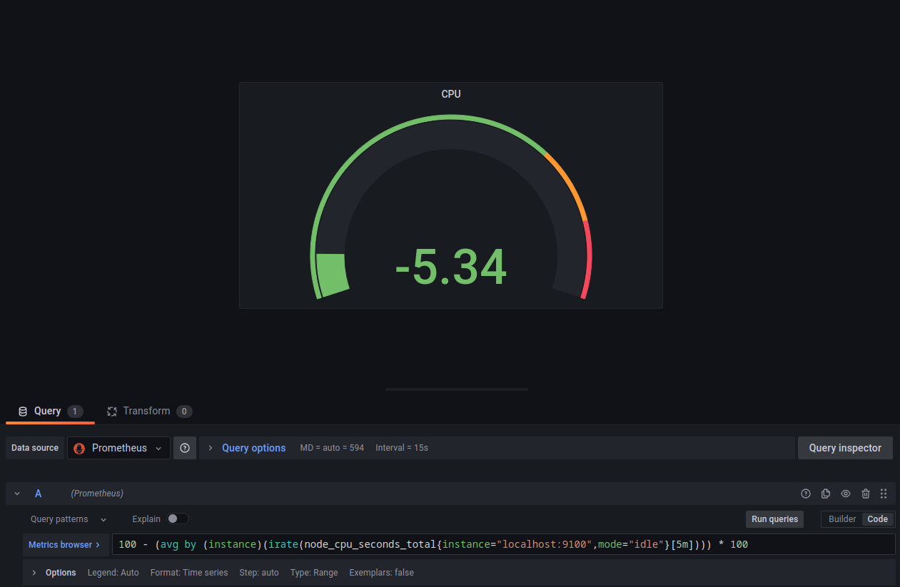
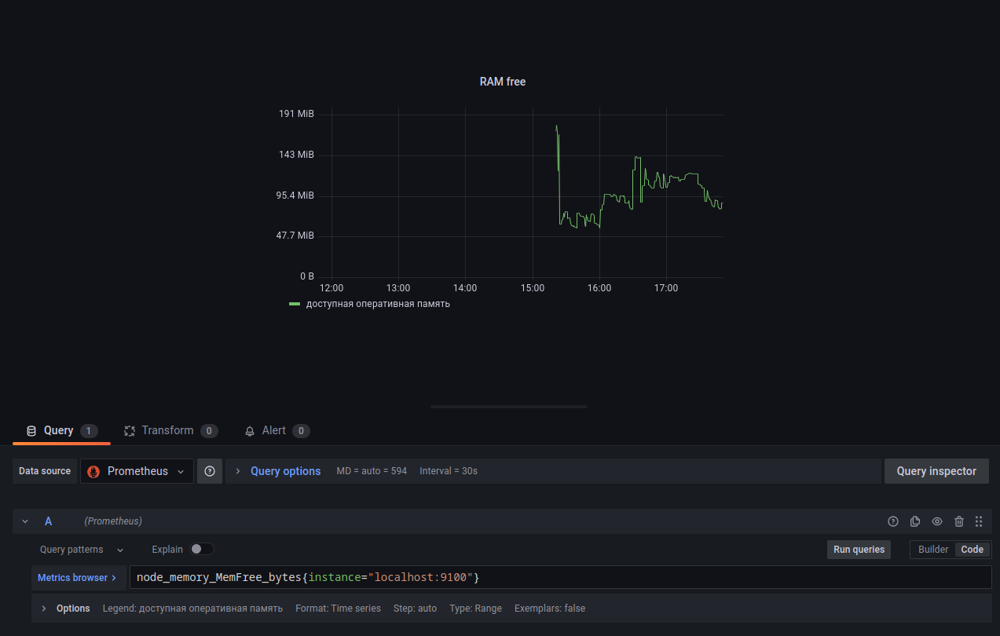
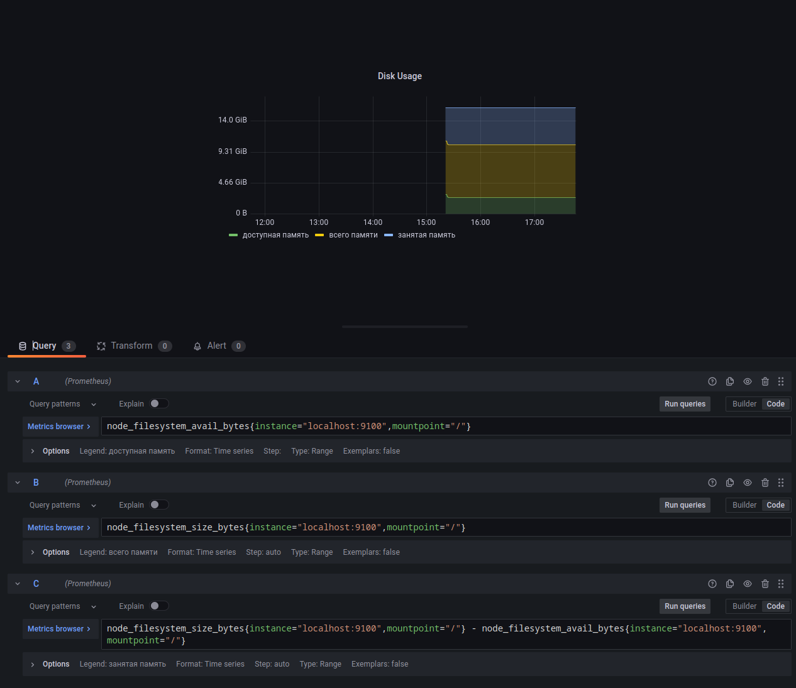
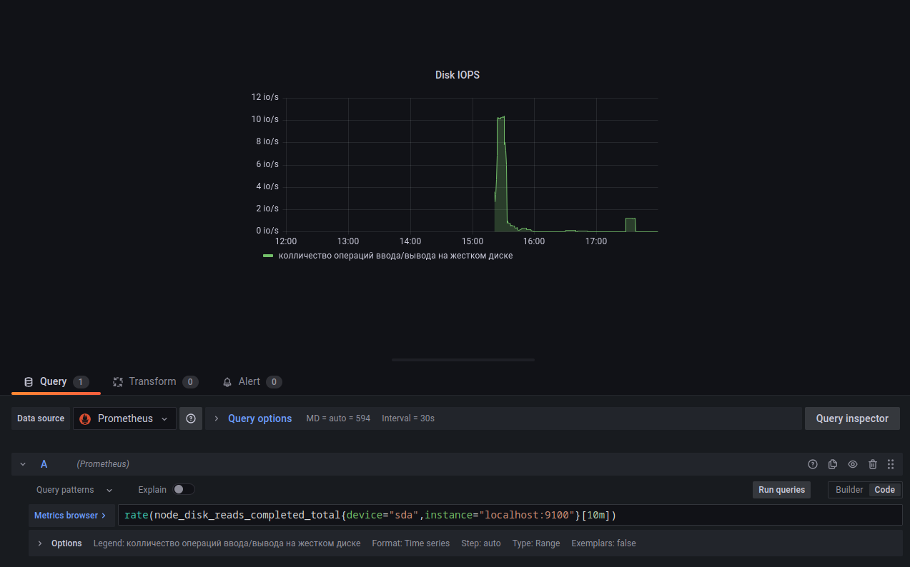
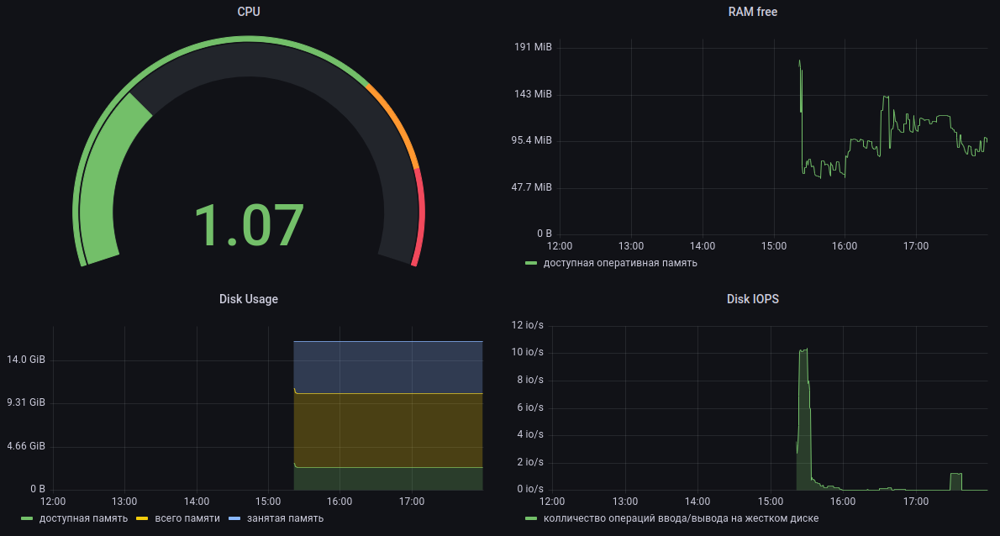
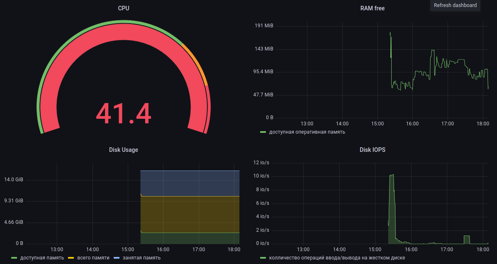
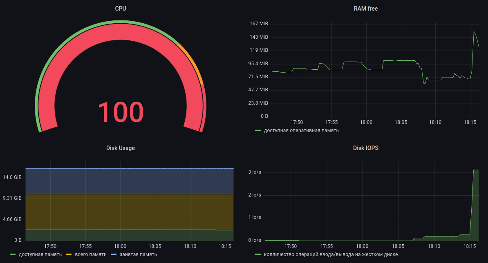

## Dashboard

* Создадим панель для отображения `CPU` 
    
* Создaдим панель для отображения `доступной оперативной памяти` 
    
* Создадим панель для отображения объема `всей памяти`, `занятой памяти` и `свободной памяти` 
    
* Создадим панель для отображения `количества операций ввода/вывода на жестком диске` 
    
* Конечный результат
    
* Запустим bash-скрипт из Part 2 и проверим результаты работы
    
* Запустим команду `stress -c 2 -i 1 -m 1 --vm-bytes 32M -t 60`
    