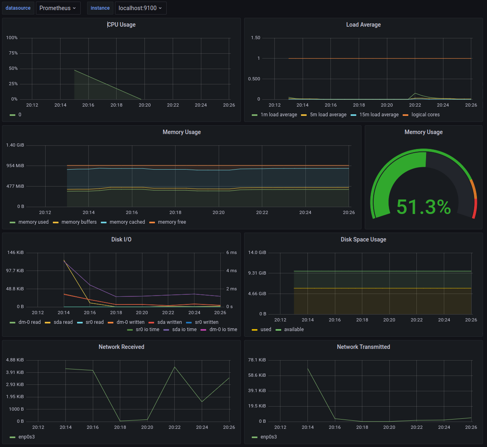
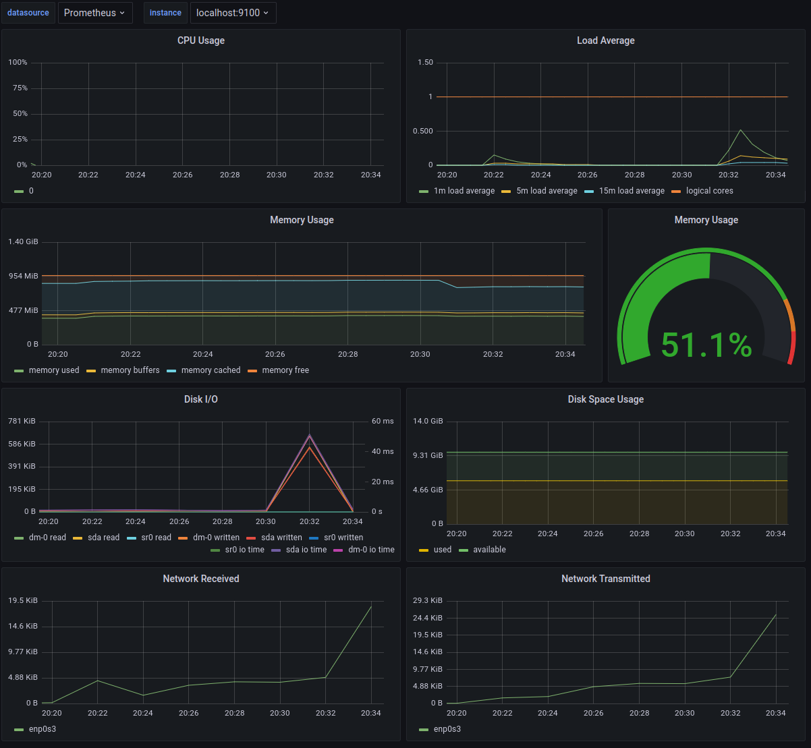
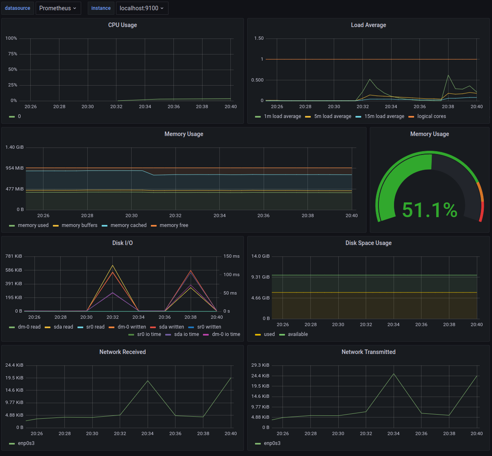
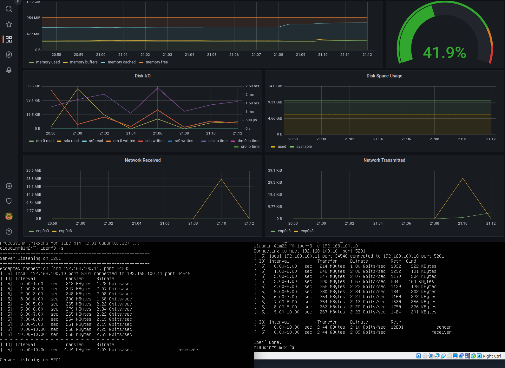

## Готовый Dashboard

* Установим готовый дашборд Node Exporter Quickstart and Dashboard с официального сайта Grafana Labs
    
* Запустим bash-скрипт из Part 2 и проверим результаты работы
    
* Запустим команду `stress -c 2 -i 1 -m 1 --vm-bytes 32M -t 60`
    
* Запустим тест нагрузки сети с помощью утилиты `iperf3` и посмотрим на нагрузку сетевого интерфейса
    