## Свой node_exporter

* Напишем bash-скрипт `info.sh`, который собирает информацию по базовым метрикам системы (ЦПУ, оперативная память, жесткий диск (объем)).  
* Скрипт формирует html-страницу `my_metrics.html` по формату Prometheus, которую будет отдавать nginx.  
* Страница обновляется внутри bash-скрипта `main.sh` в цикле каждые 3 сек.  
* Внесем изменения в конфигурационный файл `nginx.conf`  
    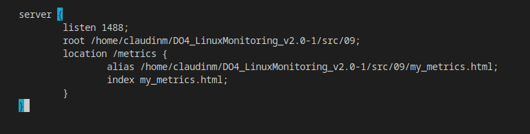  
* Внесем изменения в файл `prometheus.yml`  
    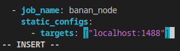  
* Запустим скрипт и проверим, что по адресу `http://localhost:9090/` добавились новые метрики  
    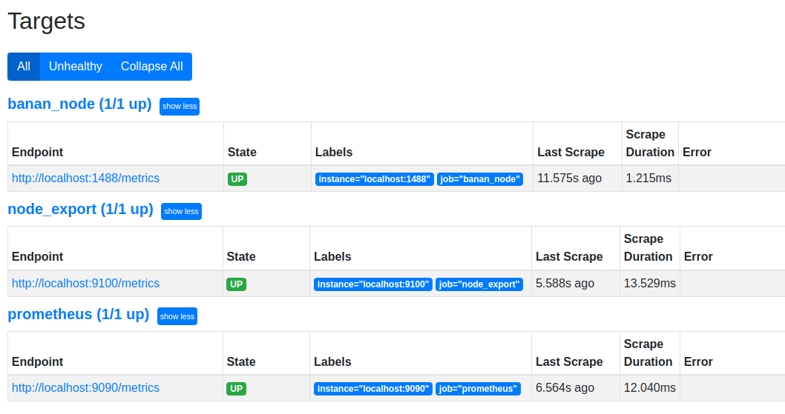  
* Сформированная `html страничка`  
    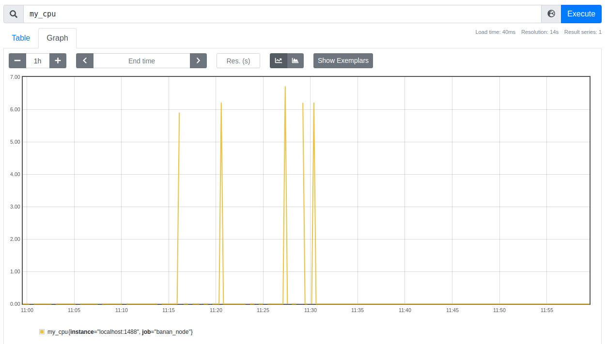  
    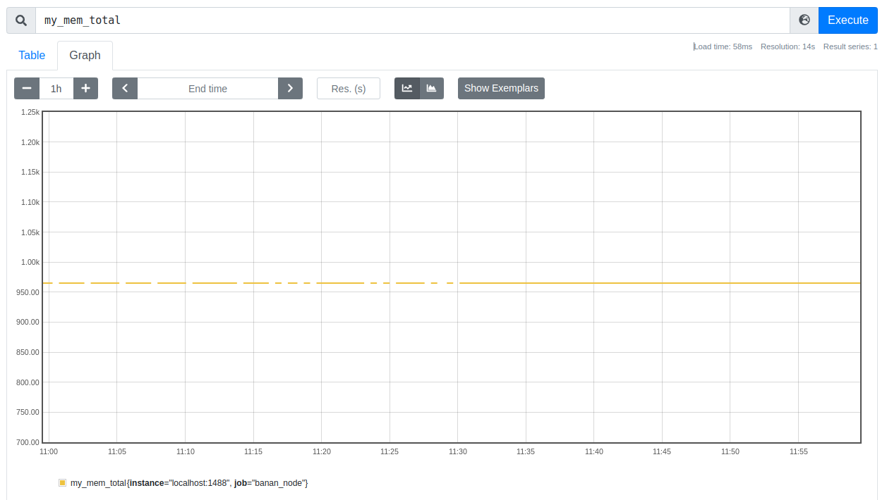  
    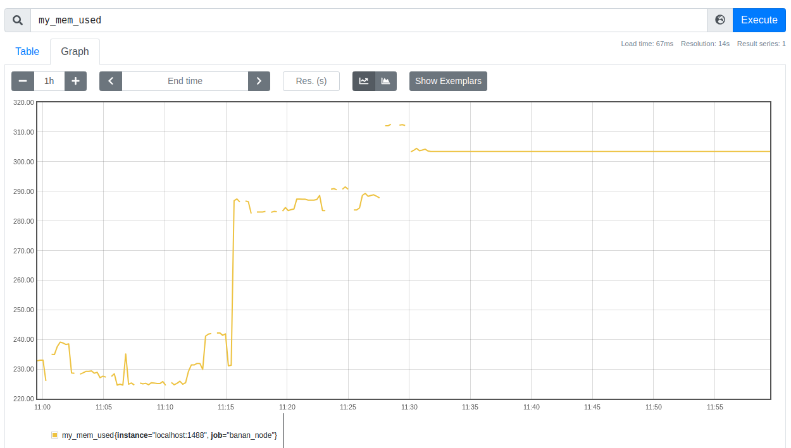  
    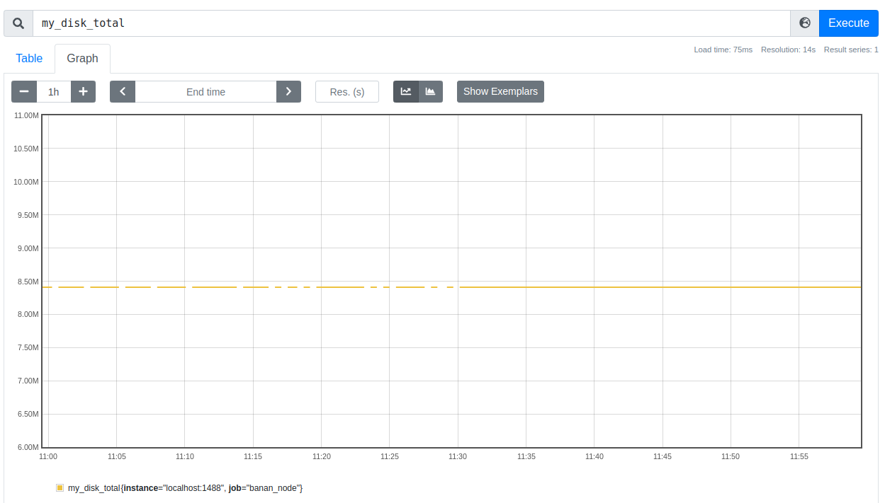  
    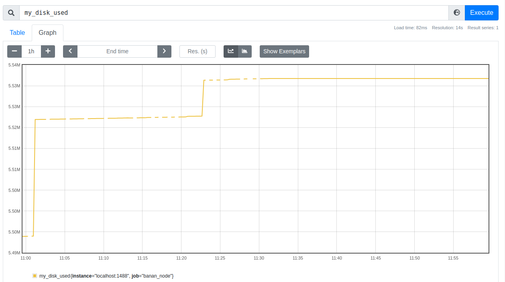  

## Запустим bash-скрипт из Part 2 и проверим результаты работы

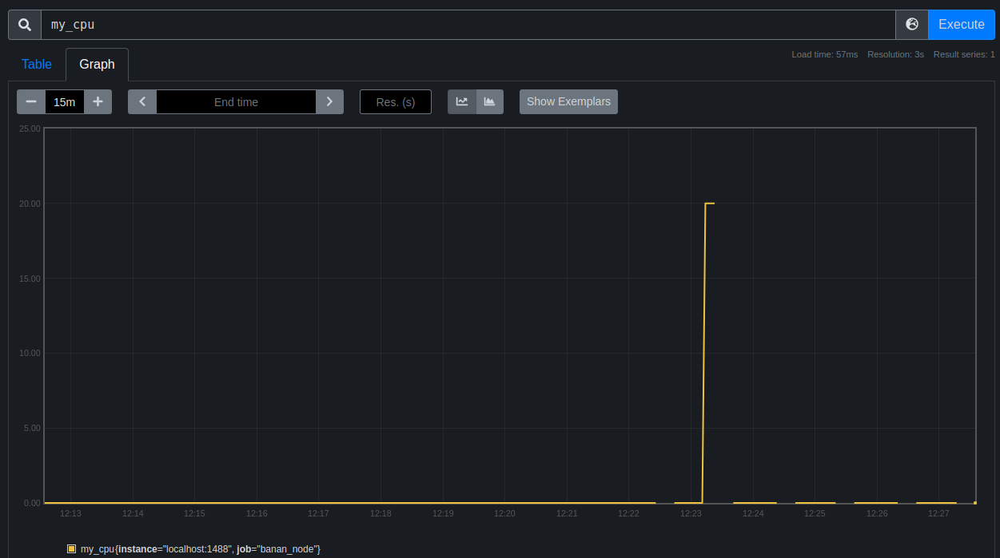  
  
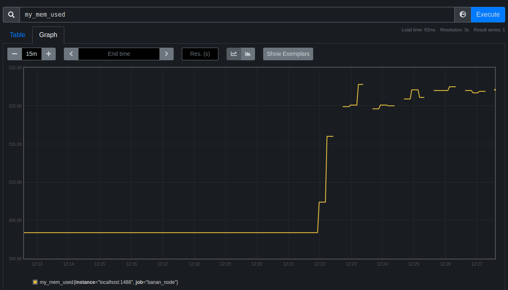  
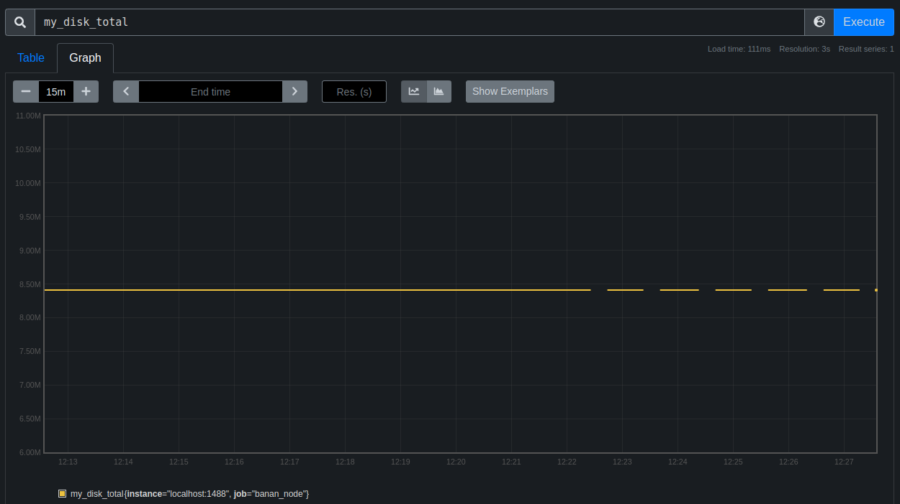  
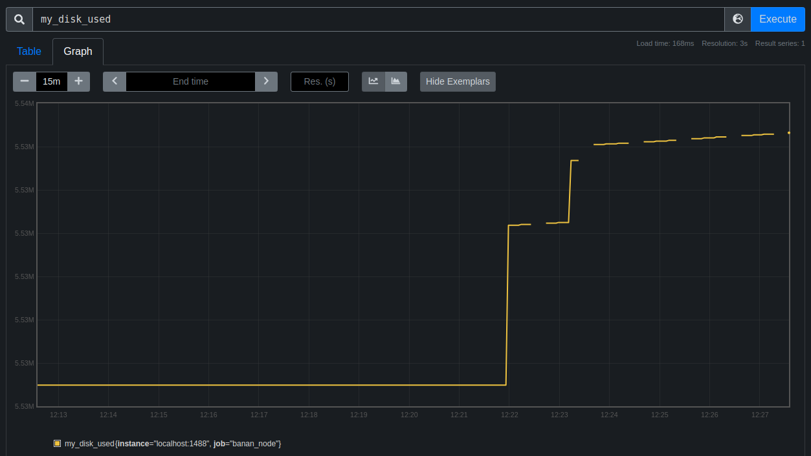  

## Запустим команду `stress -c 2 -i 1 -m 1 --vm-bytes 32M -t 60`

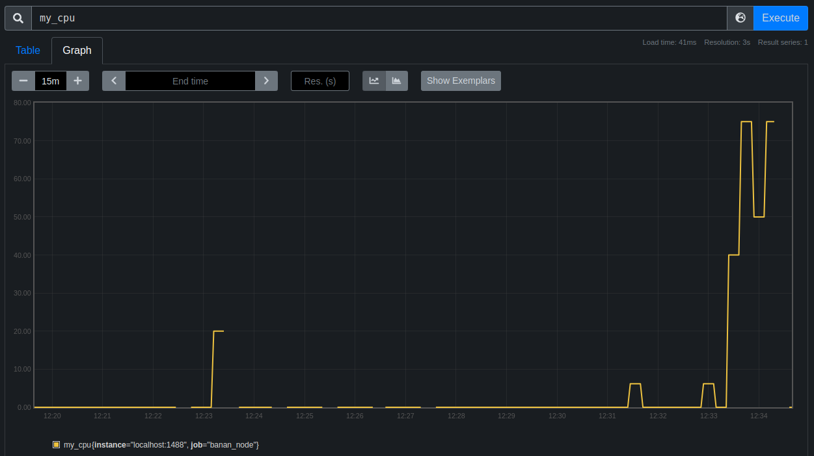  
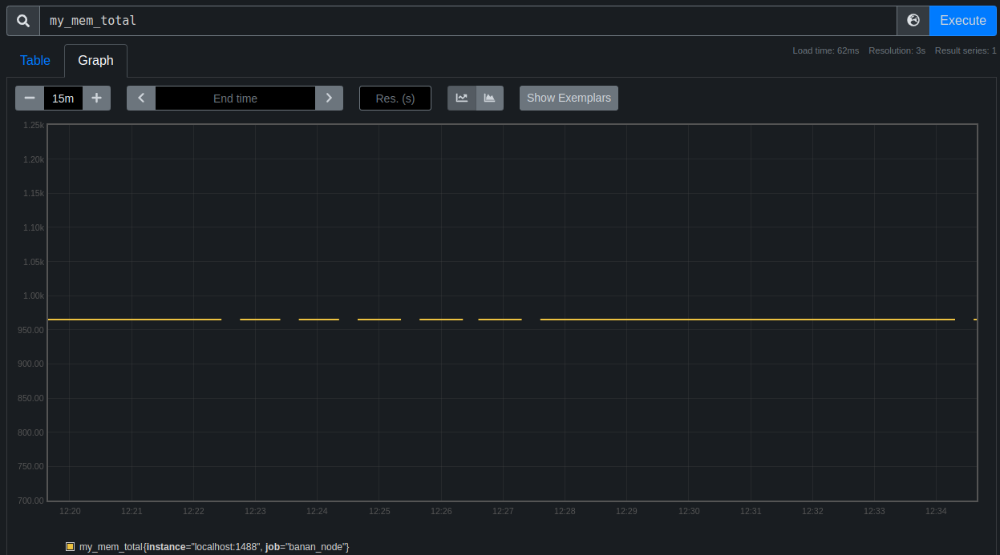  
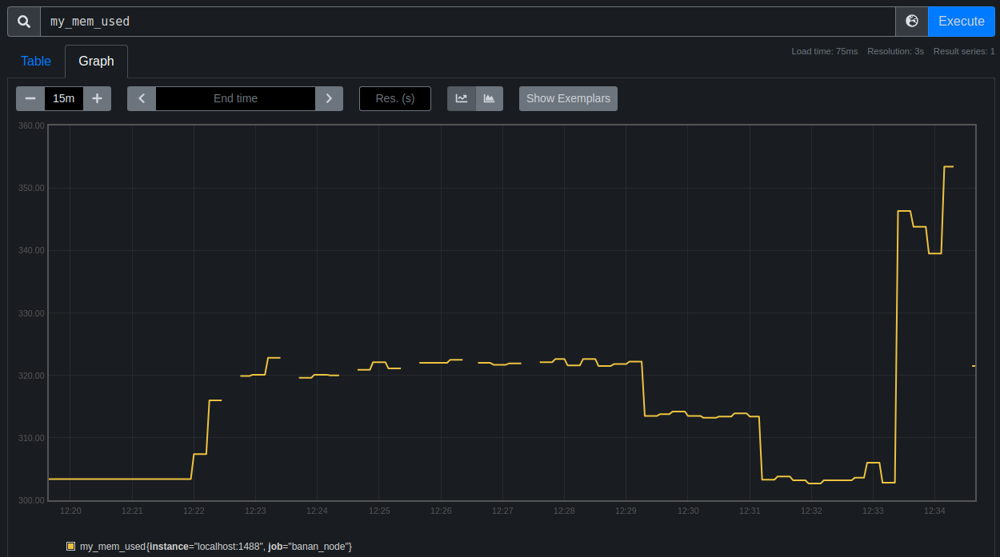  
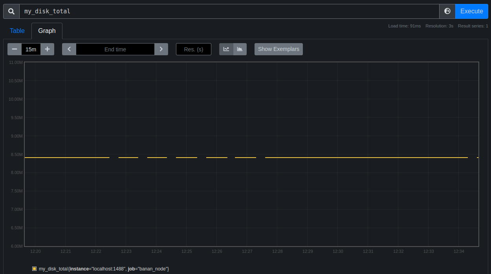  
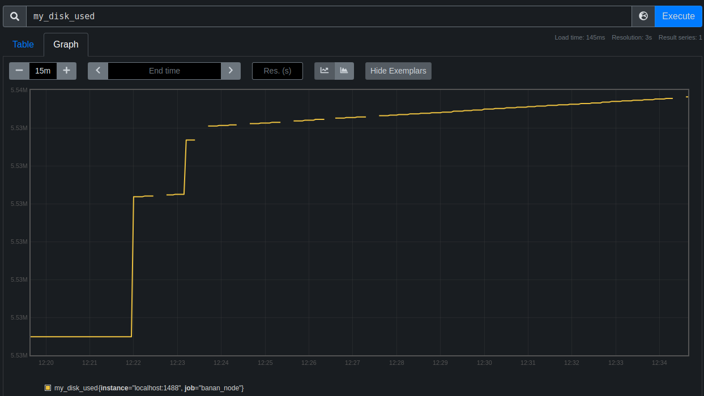  