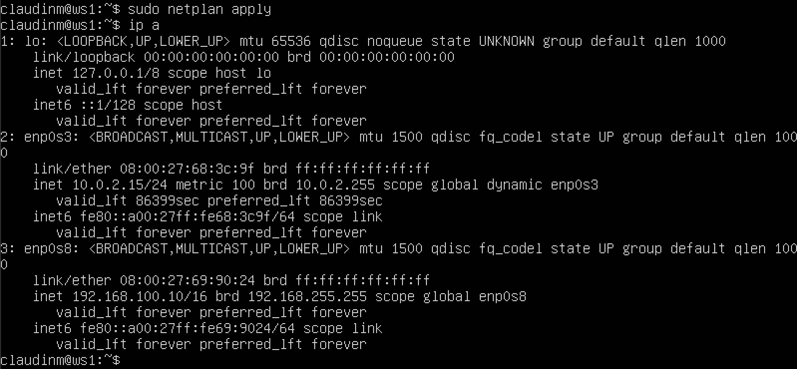
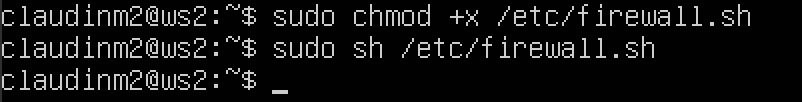
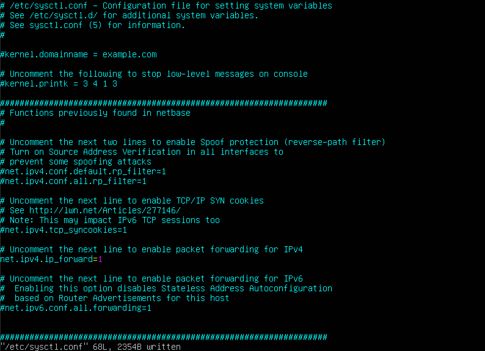
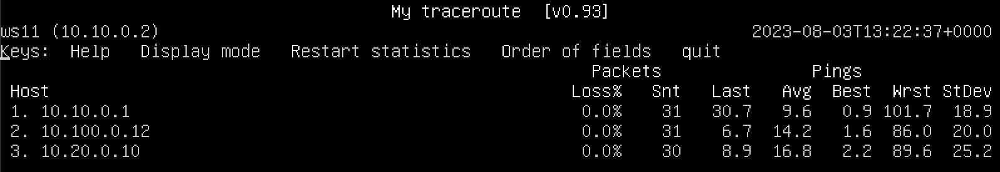
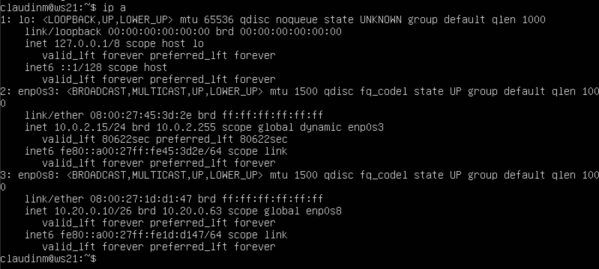
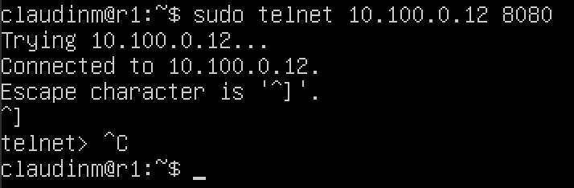

## Part 1. Инструмент ipcalc 
### Для удобства меняем **hostname** на **ws1** 
1. Сети и маски
    * Устанавливаем **ipcalc** командой `sudo apt install ipcalc` 
     *Установка ipcalc* 
    1) Адрес сети **192.167.38.54/13** `ipcalc 192.167.38.54/13` 
     *Адрес сети* 
    2) Перевод маски **255.255.255.0** в префиксную, двоичную запись `ipcalc 255.255.255.0` 
        * В префиксной записи будет **/24**. Потому что **255.255.255.0** представляет **24 бита** установленные в **1** (каждое "255" представляет 8 бит установленные в 1, и их три, так что 8 * 3 = 24)
         *Двоичная запись* 
    * **/15** в обычную и двоичную 
        * В обычной записи (десятичной) - **255.254.0.0**
        * В двоичную запись  `ipcalc /15` или `ipcalc 255.254.0.0` 
         *Обычная и двоичная запись* 
    * **11111111.11111111.11111111.11110000** в обычную и префиксную 
        * В обычной записи (десятичной) - **255.255.255.240** 
        * В првефиксной записи - **/28**, потому что 28 единиц 
        *Префиксная запись* 
    3) Минимальный и максимальный хост 
    * Для определения минимального и максимального хоста в сети необходимо узнать, какая часть IP-адреса относится к адресу сети, а какая - к адресу хоста. Это определяется маской подсети. **Минимальный хост** - это первый доступный IP-адрес в сети, а **максимальный хост** - это последний доступный IP-адрес в сети. 
    * Минимальный и максимальный хост в сети **12.167.38.4** при масках: 
        * **/8** `ipcalc 12.167.38.4/8` 
         *HostMin & HostMax* 
        * **11111111.11111111.00000000.00000000 (эквивалентвно /16)** `ipcalc 12.167.38.4/16` 
         *HostMin & HostMax* 
        * **255.255.254.0 (эквивалентно /23)** `ipcalc 12.167.38.4/23` 
         *HostMin & HostMax* 
        * **/4** `ipcalc 12.167.38.4/4` 
         *HostMin & HostMax* 
2) localhost
    * **Адрес localhost** - это специальный адрес, который всегда указывает на "этот компьютер", то есть на ту машину, на которой выполняется текущая программа. 
    * Согласно стандартам, только IP-адреса в диапазоне **127.0.0.0 - 127.255.255.255** считаются адресами **loopback** и всегда указывают на **localhost**
    * **194.34.23.100** - выходит из диапазона **loopback**, поэтому обратиться к приложению по этому ip-адресу не сможем, `ipcalc 194.34.23.100` 
     *194.32.23.100* 
    * **127.0.0.2** - входит в диапазон, соответсвенно можем обратиться к приложению, `ipcalc 127.0.0.2` 
     *127.0.0.2* 
    * **127.1.0.1** - так же входит в диапазон, можем обратиться, `ipcalc 127.1.0.1` 
     *127.1.0.1* 
    * **128.0.0.1** - выходит из диапазона, обратиться не можем, `ipcalc 128.0.0.1` 
     *128.0.0.1* 
3) Диапазоны и сегменты сетей 
1.
    * **Частные адреса** не маршрутизируются в открытом интернете и обычно используются внутри локальных сетей. Все остальные адреса могут использоваться как **публичные IP-адреса**. 
    * **Частные диапазоны** IP-адресов включают в себя следующие: 
        - **10.0.0.0 - 10.255.255.255 (10.0.0.0/8)** 
        - **172.16.0.0 - 172.31.255.255 (172.16.0.0/12)** 
        - **192.168.0.0 - 192.168.255.255 (192.168.0.0/16)** 
    * **Исходя из этого:** 
    * **10.0.0.45** - Частный `ipcalc 10.0.0.45` 
    *Private* 
    * **134.43.0.2** - Публичный `ipcalc 134.43.0.2` 
    *Public* 
    * **192.168.4.2** - Частный `ipcalc 192.168.4.2` 
    *Private* 
    * **172.20.250.4** - Частный `ipcalc 172.20.250.4` 
    *Private* 
    * **172.0.2.1** - Публичный `ipcalc 172.0.2.1` 
    *Public* 
    * **192.172.0.1** - Публичный `ipcalc 192.172.0.1` 
    *Public* 
    * **172.68.0.2** - Публичный `ipcalc 172.68.0.2` 
    *Public* 
    * **172.16.255.255** - Частный `ipcalc 172.16.255.255` 
    *Private* 
    * **10.10.10.10** - Частный `ipcalc 10.10.10.10` 
    *Private* 
    * **192.169.168.1** - Публичный `ipcalc 192.169.168.1` 
    *Public* 
2.
    * Какие из перечисленных IP адресов шлюза возможны у сети **10.10.0.0/18**
    * Находим диапазон адресов, который определяется подсетью **(/18)** `ipcalc 10.10.0.0/18` 
    *Диапазон: 10.10.0.0 - 10.10.63.255* 
    * Исходя из этого: 
        - **10.0.0.1** - Не возвможен 
        - **10.10.0.2** - Возможен 
        - **10.10.10.10** - Возможен 
        - **10.10.100.1** - Не возможен 
        - **10.10.1.255** - Возможен 

## Part 2. Статическая маршрутизация между двумя машинами 
1. 
    * Поднимаем две виртуальные машины **ws1** && **ws2** 
    * С помощью команды посмотреть существующие сетевые интерфейсы `ip a` 
    *ip a ws1* 
    *ip a ws2* 
    * Задаем адрес и маску для **ws1** с помощью VIM: `sudo vim /etc/netplan/*.yaml` 
    *Сетевой интерфейс ws1* 
    * Задаем адрес и маску для **ws2** с помощью VIM: `sudo vim /etc/netplan/*.yaml` 
    *Сетевой интерфейс ws2* 
    * Выполняем команду `sudo netplan apply` и смотрим `ip a`: 
    *ws1* 
    * Выполняем команду `sudo netplan apply` и смотрим `ip a`: 
    *ws2* 

2. Добавление статического маршрута вручную 
    * Добавление статического маршрута от одной машины до другой и обратно при помощи команды `ip r add` 
    * **ws1** - `sudo ip r add 172.24.116.8 dev enp0s3` 
     *Добавление статического маршрута для ws1* 
    * **ws2** - `sudo ip r add 192.168.100.10 dev enp0s3` 
     *Добавление статического маршрута для ws2* 
    * Пропинговать соединение между машинами: 
    * **ws1** 
     *ws1* 
    * **ws2** 
     *ws2* 
     
    * Добавление статического маршрута с сохранением 
    * Перезагружаем виртуальные машины `sudo reboot` 
    * Добавить статический маршрут от одной машины до другой с помощью файла etc/netplan/00-installer-config.yaml 
    * **ws1:** 
    *ws1* 
    * **ws2:** 
    *ws2* 
    * Пропинговать соединение между машинами 
    * **ws1** 
     *ws1* 
    * **ws2** 
     *ws2* 

## Part 3. Утилита iperf3 
1. Скорость соединения 
    * Перевести и записать в отчёт: 
        - 8 Mbps - 1 MB/s 
        - 100 MB/s - 100000 Kbps 
        - 1 Gbps - 1000 Mbps 
2. Утилита iperf3 
    * Измерить скорость соединения между ws1 и ws2 
    * Устанавливаем утилиту **iperf** на каждую виртуальную машину командой `sudo apt install iperf3` 
    * При использовании утилиты `iperf3` для тестирования пропускной способности сначала запускается сервер, а затем клиент 
    * **ws1** выступает в роли сервера, **ws2** в роли клиента 
    * Запуск сервера `iperf3 -s`: 
    *Запуск сервера* 
    * Сервер успешно запущен и готов принимать соединение от клиента 
    * Запуск клиента `iperf3 -c 192.168.100.10`: 
    *Запуск клиента* 
    *Соединение* 

## Part 4. Сетевой экран 
1. Утилита iptables 
    * Устанавливаем **iptables** на каждую машину командой `sudo apt install iptables` 
    * Создаем файл **/etc/firewall.sh**, имитирующий фаерволл, на каждой виртуальной машине `sudo vim /etc/firewall.sh`: 
    *Firewall.sh* 
    * Добавляем в файл следующие правила: 
        - на ws1 применить стратегию когда в начале пишется запрещающее правило, а в конце пишется разрешающее правило (это касается пунктов 4 и 5) 
        - на ws2 применить стратегию когда в начале пишется разрешающее правило, а в конце пишется запрещающее правило (это касается пунктов 4 и 5) 
        - открыть на машинах доступ для порта 22 (ssh) и порта 80 (http) 
        - запретить echo reply (машина не должна "пинговаться”, т.е. должна быть блокировка на OUTPUT) 
        - разрешить echo reply (машина должна "пинговаться") 
    *Firewall ws1* 
    *Firewall ws2* 
    * Запустить файлы на обеих машинах командами `sudo chmod +x /etc/firewall.sh` и `sudo sh /etc/firewall.sh` 
    *ws1* 
    *ws2* 
    * Разница между стратегиями заключается в том, что на первой виртуальной машине (**ws1**) мы сначала запрещаем, а потом разрешаем, а во второй (**ws2**) - разрешаем, потом - запрещаем. 
2. Утилита **nmap** 
    * Устанавливаем **nmap** на каждую виртуальную машину командой `sudo apt install nmap` 
    * Пингуем виртуальные машины: 
    *ws1 не пингуется* 
    * Видим надпись: `Host is up` 
    *ws2 пингуется* 
    * **Создаем дампы виртуальных машин** 

## Part 5. Статическая маршрутизация сети 
### Поднимаем пять виртуальных машин (3 рабочие станции (ws11, ws21, ws22) и 2 роутера (r1, r2)) 
 *Виртуальные машины* 
1. Настройка адрессов машин 
    * Делаем настройку для каждой виртуальной машины, согласно рисунку, командой `sudo vim /etc/netplan/*.yaml` 
     *Настройка для ws11* 
     *Настройка для r1* 
     *Настройка для r2* 
     *Настройка для ws22 
     *Настройка для ws21 
    * Перезапускаем сервис сети командой `sudo netplan apply`. Если ошибок нет, то командой `ip -4 a` проверить, что адрес машины задан верно. Также пропинговать **ws22 с ws21**. Аналогично пропинговать **r1 с ws11**. 
    * **ws11, пингуем к r1** 
     *ws11* 
    * **ws21, пингуем к ws22** 
     *ws21* 
    * **ws22, пингуем к ws21** 
     *ws22* 
    * **r1, пингуем к ws11** 
     *r1* 
    * **r2** 
     *r2* 
2. Включение переадресации IP-адресов 
    * Для включения переадресации IP, выполните команду на роутерах: `sudo sysctl -w net.ipv4.ip_forward=1` 
    *r1* 
    *r2* 
    **При таком подходе переадресация не будет работать после перезагрузки системы** 
    * Откройте файл **/etc/sysctl.conf** и добавьте в него следующую строку: `net.ipv4.ip_forward = 1` 
    *r1* 
    *r2* 
    **При использовании этого подхода, IP-переадресация включена на постоянной основе** 
3. Установка маршрута по-умолчанию 
    * Настроить маршрут по-умолчанию (шлюз) для рабочих станций. Для этого добавить **default** перед IP роутера (**gateway4**) в файле конфигураций 
    * Вызвать `ip r` и показать, что добавился маршрут в таблицу маршрутизации 
    *ws11* 
    *ws21* 
    *ws22* 
    * Пропингуем с ws11 роутер r2, пинг не пройдёт, т.к. роутер "не знает" куда вернуть ответ, при этом передача пакетов с машины осуществляется 
    *ping ws11* 
    `tcpdump -tn -i eth1` 
    * Изменим **eth1** на название нашего адаптера **enp0s8** 
    *Вывод r2* 
4. Добавление статических маршрутов 
    * Добавить в роутеры **r1** и **r2** статические маршруты в файле конфигураций: 
    *r1* 
    *r2* 
    * Вызвать ip r и показать таблицы с маршрутами на обоих роутерах 
    *r1* 
    *r2* 
    * Запустить команды на **ws11**: `ip r list 10.10.0.0/[маска сети]` и `ip r list 0.0.0.0/0` 
    *ws11* 
    * В отчете выбран путь отличный от **10.10.0.0** - этот адрес указывает на все адреса
5. Построение списка маршрутизаторов  
    * Запускаем на **r1** команду дампа: `sudo tcpdump -tnv -i enp0s8`: 
    *r1* 
    * Вместо **traceroute** я использовал альтернативу **mtr (MyTraceRoute)** `mtr 10.20.0.10` 
    *ws11* 
    * Путь строится от узла к узлу до того момента, пока не будет достигнута конечная точка. Каждый пакет проходит на своем пути определенное количество узлов, пока не достигнет своей цели. На каждом узле добавляется счетчик, который отслеживает количество пройденых узлов 
6. Использование протокола ICMP при маршрутизации 
    * Запустить на **r1** перехват сетевого трафика, проходящего через **enp0s8** с помощью команды: `tcpdump -n -i enp0s8 icmp` 
    *r1* 
    * Пропинговать с **ws11** несуществующий **IP** (например, **10.30.0.111**) с помощью команды: `ping -c 1 10.30.0.111` 
    *ws11* 
    * Сохраняем дампы образов виртуальных машин 

## Динамическая настройка IP с помощью DHCP 
1. Чтобы работать с **DHCP**, необходимо установить утилиту **isc-dhcp-server**. Устанавливает ее командой `sudo apt-get install isc-dhcp-server` 
    * Настраиваем конфигурацию службы **DHCP** в файле **/etc/dhcp/dhcpd.conf** через **VIM** 
    * Указываем адрес маршрутизатора по-умолчанию, DNS-сервер и адрес внутренней сети:
    *Добавляем конфигурацию в конце файла* 
2. В файле resolv.conf прописать nameserver 8.8.8.8: `sudo vim /etc/resolv.conf` 
    *resolv.conf r2* 
    * Перезагружаем службу **DHCP** командой `systemctl restart isc-dhcp-server` 
    *Перезагрузка службы DHCP* 
    * Перезагружаем виртуальную машину **ws21** и через ip a показать, что она получила адрес: 
    *ip a ws21* 
    * Проверяем пинг у **ws21** и **ws22** 
    *Пингуем ws21 к ws22* 
    *Пингуем ws22 к ws21* 
    * Указываем **MAC адрес** у **ws11**: **macaddress: 10:10:10:10:10:BA, dhcp4: true**
    *Указываем MAC адрес* 
    * Для r1 настроить аналогично r2, но сделать выдачу адресов с жесткой привязкой к MAC-адресу 
    * Устанавливаем DHCP `sudo apt-get install isc-dhcp-server` 
    * Настраиваем конфигурацию `sudo vim /etc/dhcp/dhcpd.conf` 
    *Добавляем конфигурацию в конце файла* 
    * Вносим изменения в resolv.conf `sudo vim /etc/resolv.conf` 
    *resolv.conf r1* 
    * Перезагружаем службу **DHCP** командой `systemctl restart isc-dhcp-server` 
    *Перезагрузка службы DHCP* 
    * Перезагружаем виртуальную машину **ws11** и через ip a показать, что она получила адрес: 
    *ip a ws11* 
    * Проверяем пинг у **ws11** и **ws22** 
    *Пингуем ws11 к ws22* 
    *Пингуем ws22 к ws11* 
    * Запрашиваем с **ws21** обновление ip адреса 
    *ip до обновления* 
    * Запрашиваем с **ws21** обновление ip адреса с помощью команды `sudo dhclient -v` 
    *Запрашиваем обновление* 
    *ip после обновления* 
    * Выполняем команду `sudo dhclient -r`, чтобы очистить список ip адресов 
     *Очищаем список* 
    * В данном пункте пользовался опциями `-v` и `-r` 

## Part 7. NAT 
* Для работы с **apache2**, установим его на машины **ws22** и **r1**: `sudo apt install apache2` 
1. Делаем сервер **Apache2** общедоступным 
    * В файле **/etc/apache2/ports.conf** на **ws22** и **r1** изменить строку **Listen 80** на **Listen 0.0.0.0:80** 
    *ws22 и r1* 
    * Запускаем сервер **Apache2** командой `service apache2 start` на **ws22** и **r1** 
    *ws22* 
    *wr1* 
2. Делаем фаервол на **r2** со следующими правилами: 
    1) удаление правил в таблице filter - `iptables -F` 
    2) удаление правил в таблице "NAT" - `iptables -F -t nat` 
    3) отбрасывать все маршрутизируемые пакеты - `iptables --policy FORWARD DROP` 
     *firewall r2* 
    * Запустим файл командами: 
    `sudo chmod +x /etc/firewall.sh` и `sudo bash /etc/firewall.sh` 
    *r2* 
    * При запуске файла **firewall.sh** с этими правилами, **ws22** не должна "пинговаться" с **r1** 
    `ping -c 4 10.100.0.11` на **ws22** 
    *Пингуем ws22 к r1* 
    * Добавляем в фаервол еще одно правило: 
    4) разрешить маршрутизацию всех пакетов протокола **ICMP** 
     *firewall r2* 
    * Запустим файл командой `sudo bash /etc/firewall.sh` и теперь **ws22** должна пинговаться с **r1** 
    *Пингуем ws22 к r1* 
    *Пингуем r1 к ws22* 
    * Добавляем в фаервол еще два правила: 
    5) включить **SNAT**, а именно маскирование всех локальных ip из локальной сети, находящейся за **r2** (по обозначениям из Части 5 - сеть 10.20.0.0) 
    6) включить **DNAT** на 8080 порт машины **r2** и добавить к веб-серверу **Apache**, запущенному на **ws22**, доступ извне сети 
    *Добавляем изменения в firewall* 
    * Запустим файл командой `sudo bash /etc/firewall.sh` и проверим соединение по **TCP** для **SNAT**, для этого с **ws22** подключимся к серверу **apache** на **r1** `telnet [адрес] [порт]` 
     *Проверяем соединение* 
    * Проверить подмену IP-адреса можно с помощью команды **tcpdump** - пингуем с машины **ws22 роутер r1**, в выводе **tcpdump** будет отображаться с какого адреса идет запрос - **IP-адрес r2** 
    * Пингует **ws22** к **r1** 
    *Пингуем r1 к ws22* 
    * `sudo tcpdump -i enp0s9` 
    *Проверяем подмену IP-адреса* 
    * Для проверки соединения по **TCP** для **DNAT** нужно отключить **NAT (enp0s3)** на **ws22** 
    * Подключаемся к серверу **Apache** на **ws22** (обращаться по адресу **r2** и порту **8080**) 
    * `telnet [адрес] 8080` 
     *Подключаемся к серверу* 
    * Проверяем соединение: 
    * `sudo tcpdump -i enp0s8` 
    *Проверяем соединение* 
    * Сохраняем дампы виртуальных машин 

## Part 8. Дополнительно. Знакомство с SSH Tunnels 
0. * Запустим фаервол на **r2** командами: `sudo chmod +x /etc/firewall.sh` и `sudo bash /etc/firewall.sh` 
    * Запускаем веб-сервер **Apache** на **ws22** только на **localhost** (то есть в файле **/etc/apache2/ports.conf** изменить строку **Listen 80** на **Listen localhost:80**) 
    *Меняем на localhost* 
    * Проверяем статус **Apache**: 
    *Проверяем статус* 
1. * Воспользоваться **Local TCP forwarding с ws21 до ws22**, чтобы получить доступ к веб-серверу на **ws22 с ws21** 
    * На виртуальной машине **ws21** выполняем команду `ssh -L local_port:ws22_ip:web_server_port user@localhost`, где: 
    * `local_port` - порт, на котором находится веб-сервер 
    * `ws22_ip` - IP-адрес виртуальной машины **ws22** 
    * `web_server_port` - порт, на котором находится веб-сервер 
    * `user` - имя пользователя 
     
    * На машине **ws22** запускаем утилиту **telnet** 
     *Видим сервер* 
2. Воспользоваться **Remote TCP forwarding c ws11 до ws22**, чтобы получить доступ к веб-серверу на **ws22** с **ws11** 
    * На виртуальной машине **ws11** выполняем команду `ssh -R remote_port:ws22_ip:web_server_port user@localhost`, где: 
    * `remote_port` - порт на ws22, через который будет доступен веб-сервер 
    * `ws22_ip` - IP-адрес виртуальной машины **ws22** 
    * `web_server_port` - порт, на котором находится веб-сервер 
    * `user` - имя пользователя 
     
    * На машине **ws22** запускаем утилиту **telnet** 
     *Видим сервер* 
    * Сохраняем дампы виртуальных машин 