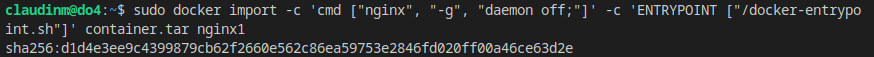
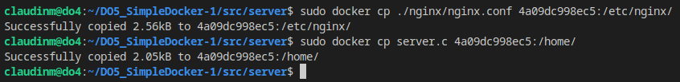
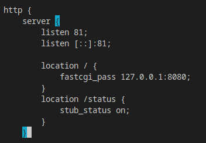
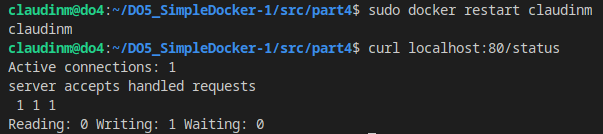

# Simple Docker

## Part 1. Готовый докер

* Если Docker не установлен на систему - устанавливаем командой `sudo apt install docker.io`  
* Выполним несколько команды, которые требуются по заданию: 
    1. Взять официальный докер образ с nginx и выкачать его при помощи `docker pull` 
    2. Проверить наличие докер образа через `docker images`  
    3. Запустить докер образ через `docker run -d [image_id|repository]` 
    4. Проверить, что образ запустился через `docker ps` 
     *Образ nginx: установка и проверка* 
* Посмотреть информацию о контейнере через `docker inspect 71a89f42fc41` 
* По выводу команды определить и поместить в отчёт размер контейнера, список замапленных портов и ip контейнера 
     *Размер контейнера* 
     *Список замапленных портов* 
     *IP контейнера* 
* Остановить докер образ через `docker stop [container_id|container_name]` 
     *Остановка образа* 
* Запустить докер с портами 80 и 443 в контейнере, замапленными на такие же порты на локальной машине, через команду run 
* Проверить, что в браузере по адресу localhost:80 доступна стартовая страница nginx 
     *Стартовая страница достпуна* 
* Перезапустить докер контейнер через `docker restart [container_id|container_name]` 
* Проверить любым способом, что контейнер запустился 
     *Перезагрузка и проверка* 

## Part 2. Операции с контейнером

* Прочитать конфигурационный файл `nginx.conf` внутри докер контейнера через команду `exec` 
     *файл nginx.conf* 
* Создать на локальной машине файл `nginx.conf` 
* Настроить в нем по пути `/status` отдачу страницы статуса сервера `nginx` 
     *Создание файла* 
* Скопировать созданный файл nginx.conf внутрь докер образа через команду `docker cp` 
* Перезапустить nginx внутри докер образа через команду `exec` 
* Проверить, что по адресу `localhost:80/status` отдается страничка со статусом сервера `nginx` 
     *Копирование образа и перезапуск nginx, /status* 
* Экспортировать контейнер в файл container.tar через команду export 
* Остановить контейнер 
     *Экспорт и остановка* 
* Удалить образ через `docker rmi [image_id|repository]`, не удаляя перед этим контейнеры 
     *Удаление образа* 
* Удалить остановленные контейнеры 
     *Удаление остановленых контейнеров* 
* Импортировать контейнер обратно через команду `import` 
     *Импорт* 
* Запустить импортированный контейнер 
* Проверить, что по адресу `localhost:80/status` отдается страничка со статусом сервера `nginx` 
     *Запуск и проверка* 

## Part 3. Мини веб-сервер

* Выкачаем образ `nginx` и проверим его 
     *Образ nginx* 
* Установим утилиту `FastCGI`, а так же библиотеку для разработки 
     *Установка утилиты и библиотеки* 
* Напишем мини сервер на C и FastCgi, который будет возвращать простейшую страничку с надписью Hello World! 
     *Сервер на C и FastCGI* 
    1. `FCGI_Accept()` - это функция, предоставляемая библиотекой FastCGI, которая ожидает и принимает новый HTTP-запрос от клиента (обычно веб-браузера). Когда новый запрос приходит к FastCGI-приложению, FCGI_Accept() начинает его обработку 
    2. `while (FCGI_Accept() >= 0)` - это бесконечный цикл, который выполняется до тех пор, пока FCGI_Accept() возвращает неотрицательное значение. Если FCGI_Accept() возвращает отрицательное значение, это обычно указывает на ошибку или завершение работы приложения 
    3. `Content-type: text/html\r\n` - Это HTTP-заголовок, который указывает тип контента, который будет отправлен в ответ на запрос. В данном случае, тип контента установлен как "text/html", что означает, что ответ будет в формате HTML 
* Устанавливаем компилятор `gcc` и запускаем написанный мини сервер на порту `8080` 
     *Запуск сервера* 
* Напишем свой `nginx.conf`, который будет проксировать все запросы с `81` порта на `127.0.0.1:8080` 
     *Файл nginx.conf* 
     *Запуск образа и проверка* 
* Копируем конфигурационный файл и сервер в докер контейнер 
     *Копирование файлов* 
* Зайдем в контейнер и проверим, что файлы скопированы 
     *Успешная проверка* 
* Компиляция и запуск сервера. Перезагрузка контейнера и проверка, что отдается написанная страничка 
     *localhost:81* 

## Part 4. Свой докер

* Создадим файл-скрипт, который будет запускать сервер 
     *Файл-скрипт start-server.sh* 
* Создадим докер образа 
     *Dockerfile* 
* Собираем написанный докер образ через `docker build` при этом указав имя и тег 
     *Сборка образа* 
* Проверить через `docker images`, что все собралось корректно 
     *Проверка* 
* Запускаем собранный образ с **маппингом `81 порта на 80`** и **маппингом папки `./nginx`** внутрь контейнера по адресу, где лежат конфигурационные файлы `nginx'а` 
* Проверим, что по `localhost:80` доступна страничка написанного мини сервера 
     *Запуск образа и проверка контейнера, проверка по адресу* 
* Допишем в `./nginx/nginx.conf` проксирование странички `/status`, по которой надо отдавать статус сервера `nginx` 
     *Добавление /status в конфигурационный файл* 
* Перезапускаем докер образ и проверяем, что теперь по `localhost:80/status` отдается страничка со статусом `nginx` 
     *Перезапуск и провека* 
* Если всё сделано верно, то, после сохранения файла и перезапуска контейнера, конфигурационный файл внутри докер образа должен обновиться самостоятельно без лишних действий 
     *Проверка обновления изменений* 

## Part 5. Dockle

* Для работы с `Dockle` необходимо установить соответсвующую утилиту под конкретную операционную систему <https://github.com/goodwithtech/dockle#homebrew-mac-os-x--linux-and-wsl>
     *Установка утилиты* 
* Просканируем образ из предыдущего задания через `dockle [image_id|repository]` 
     *Сканирование образа* 
* Исправим `Dockerfile`, так чтобы при проверке не возникало ошибок и предупреждений, и соберем образ 
     *Сборка и проверка* 
* Повторно просканируем образ через `dockle [image_id|repository]` 
     *Сканирование образа* 

## Part 6. Базовый Docker Compose

* Изменим конфигурационные файлы 
     *Файл nginx.conf* 
     *Файл .sh* 
* Создадим файл `docker-compose` 
    
* Остановим все запущенные контейнеры, если таковые имеются 
     *Контейнеры* 
* Выполняем сборку проекта 
     *Выполняем команду* 
* Запускаем все контейнеры в режиме `detach`, что означает, что контейнеры будут работать в фоновом режиме 
* Проверяем, что контейнеры запустились 
* Проверяем страницу в браузере 
     *Успешно!* 
* Для остановки используется команда `stop` и для удаления - `down` 
     *Команды stop и down, проверка* 